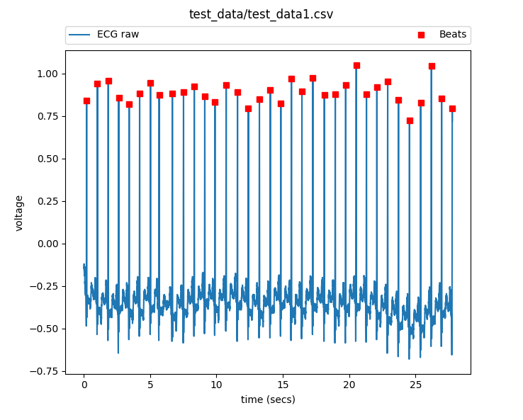

# bme590hrm - Heart Rate Monitor Module [](https://travis-ci.org/vertikoff/bme590hrm)

`heart_rate_monitor.py` is a module housing the `HeartRateMonitor` class. This class accepts a path to a local CSV file that contains `time, voltage` pairs.

Test data is housed in `test_data/test_data1.csv`

More test data can be found [here](https://github.com/mlp6/Medical-Software-Design/tree/master/Assignments/HeartRateMonitor/test_data).

`HeartRateMonitor` class analyzes the ECG input signal and creates the following attributes: 

* `mean_hr_bpm`: average heart rate over a user specified number of minutes (defaults to average rate over entire CSV). Users can update this value by calling the `HeartRateMonitor.calc_mean_hr_bpm(start_ts, end_ts)` method.
* `voltage_extremes`: tuple of min and max lead voltages. Format `(min_voltage, max_voltage)`
* `duration`: duration of the ECG data
* `num_beats`: number of detected beats in ECG data
* `beats`: numpy array of times when beats occurred

Upon successful creation of a `HeartRateMonitor` class instance, a JSON file with the above attributes is saved in the `output_json_files` directory. The JSON file will have the same name as the source CSV file `test_data.csv -> test_data.json`

## Creating an instance of the HeartRateMonitor class
First, ensure that you're in a virtual environment and have installed all of the packages listed in `requirements.txt`. More information on virtual environement [here](https://github.com/mlp6/Medical-Software-Design/blob/master/Lectures/PythonFundamentals.md).

Import the class:

```from heart_rate_monitor import HeartRateMonitor```

Next, create an instance of the class (and pass in a local CSV): 

```a = HeartRateMonitor('test_data/test_data1.csv')```

Notice that a JSON file with the attributes described above has been created in the `output_json_files` directory. 

Additionally, users can access any of the attributes within their python code like so:

`ecg_duration = a.duration`

For a complete list of available attributes, see the [documentation](http://heart-rate-monitor-bme-590s.readthedocs.io/en/latest/py-modindex.html).

## Extra features
Users can generate plots of the raw ECG data and the detected heart beats using the `HeartRateMonitor.plot_ecg_and_beats()` method. 

Example plot: 




### Mac OSX Users Note: 
The `matplotlib` doesn't work well with all virtual environments. If you're seeing errors, please make sure that you're using `venv` instead of `virtualenv` to create your virtual environment. More [here](https://matplotlib.org/faq/osx_framework.html). 

## Note on peak detection
Signal processing is NOT my strong suit. To detect peaks in ECG data, I'm using the `peakutils` python module. Documentation can be found [here](http://peakutils.readthedocs.io/en/latest/index.html). 


## Logging
Detailed logs can be found in the `logs` directory.

## Documentation 
Documentation can be found [here](http://heart-rate-monitor-bme-590s.readthedocs.io/en/latest/py-modindex.html).
